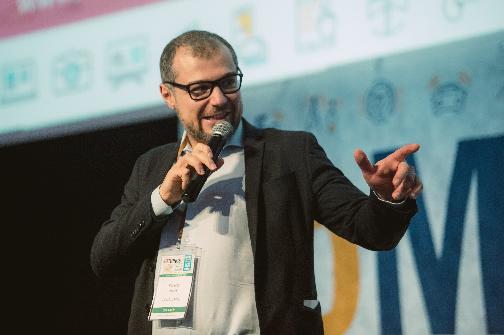

# Me in a Nutshell

I am an Innovation Manager with an international experience in e-government projects and digital transformation of the public sector both at the EU and at the national level (parliamentary bodies, public finance, procurement, strategic infrastructures, utilities) as well as 20 years of experience in ICT engineering and management, business and financial planning, strategic development in diverse and multistakeholder environments.

Indeed, as I view large-scale projects as the complex interplay of many different areas, I seek constant involvement in all facets of the digital transformation: technology, financing, organization, security, communication, governance, policymaking, society, environment.

I build and develop strong relationships with regulators, SMEs, financial institutions, and industry associations throughout Europe in order to monitor public policies and industry initiatives, assess the impact for the relevant stakeholders, influence decisions to support their requirements, and keep them informed so that they can position themselves for efficient growth.

I am a member of standardisation bodies at the national and EU level and of several international and regional associations. I also research and teach on the organisational, economical and formal aspects of innovation and digital transformation. By delivering keynotes in conferences and meetings throughout Europe and by conducting an extensive communication campaign, I strive to be a thought leader on digital transformation and its impact on our society and culture.

As the proud founder of <a href="https://eutopian.eu" target="_blank">Eutopian</a>, a think tank focused on digital citizenship, I believe in technology as an enabler for democracy.

Currently based in Rome, Italy, and Brussels, Belgium.

## Why a GitHub Account

For anybody believing in collaborative and open models, GitHub is *the* place to be.

## Contacts

Feel free to drop me a line at [roberto@reale.me](mailto:roberto@reale.me) or on [Twitter](https://twitter.com/Reale_EU).

Should you need to send me encrypted stuff, my PGP public key is [here](https://keyring.reale.me/reale-pgp.txt).
